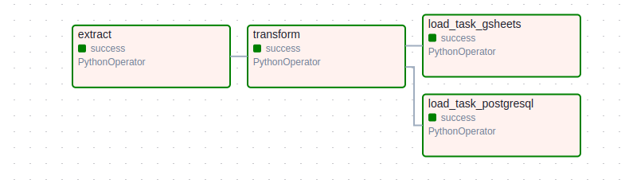

# 📚 Trilha Final Ciência de Dados Jr

O objetivo deste projeto é realizar uma análise detalhada dos dados coletados em nossa pesquisa de satisfação da comunidade nos meses de junho e julho de 2024. Utilizaremos ciência de dados para extrair insights significativos que possam orientar tanto estratégias imediatas quanto decisões a longo prazo.

Conforme a nossa comunidade cresce em números com velocidade, torna-se crucial entendermos e atendermos às expectativas e necessidades dos nossos membros. Para isso, realizamos periodicamente pesquisas de satisfação, visando obter feedback valioso que nos guie na melhoria contínua dos nossos workshops, mentorias e experiência geral oferecida. Vale lembrar que os participantes desta trilha devem escolher apenas uma área de interesse específica. 

Este projeto realiza a extração, transformação e carga (ETL) dos dados de satisfação dos membros de uma comunidade de código. 

## Tecnologias Utilizadas

- **gspread**: Para interagir com Google Sheets.
- **oauth2client**: Para autenticação OAuth 2.0.
- **pandas**: Para manipulação e análise de dados.
- **requests**: Para fazer requisições HTTP.
- **psycopg2-binary**: Para conectar ao banco de dados PostgreSQL.
- **Apache Airflow**: Para orquestrar o fluxo de trabalho de ETL.

## Trilha Escolhida: Engenheiro de Dados
### Engenheiro(a) de Dados I - Nível Júnior
#### Desafios e Expectativas:
- Realizar tarefas básicas de ETL e manutenção de bancos de dados.
- Criar e otimizar consultas SQL simples.
- Trabalhar com ferramentas e práticas de modelagem de dados básicas.
- Implementar processos de ETL para integrar dados de diferentes fontes.
- Demonstrar conhecimento básico em modelagem dimensional e estrutura de dados.
- Manter e atualizar o banco de dados com eficiência.
### Engenheiro(a) de Dados II - Nível Intermediário
#### Desafios e Expectativas:
- Desenvolver processos de ETL mais complexos e otimizar modelos de dados.
- Trabalhar com ferramentas de integração de dados e plataformas na nuvem.
- Realizar modelagem de dados para suportar análises avançadas.
- Criar e otimizar pipelines de ETL que integrem dados de várias fontes.
- Implementar soluções de modelagem de dados que suportem as necessidades analíticas.
- Utilizar plataformas na nuvem e ferramentas de BI para melhorar a performance e escalabilidade.
### Engenheiro(a) de Dados III - Nível Avançado
#### Desafios e Expectativas:
- Projetar e implementar arquiteturas de dados complexas e escaláveis.
- Resolver problemas de performance em ambientes de dados na nuvem e híbridos.
- Propor e implementar soluções de governança de dados e práticas avançadas de modelagem.
- Desenvolver arquiteturas de dados eficientes e escaláveis que suportem grandes volumes de dados.
- Resolver problemas de performance e otimizar processos em ambientes de dados complexos.
- Propor e implementar estratégias avançadas de governança e integração de dados.
  


## Instalação

1. Clone o repositório:

```bash
git clone https://github.com/AntonioC4r10s/TrilhaFinalDadosJR.git
cd seu-projeto
```
2. Instale as dependências (caso queira realizar alterações e melhorias):
```bash
pip install -r requirements.txt
```
3. Execute a construção e execução das images Docker:
```bash
docker-compose up --build
```
Para parar e iniciar respectivamente nas demais vezes, utilize apenas:
```bash
docker-compose down
```
```bash
docker-compose up -d
```

## Estrutura do Projeto
```css
├── dags
│   └── etl_dados_pesquisa.py
├── src
│   ├── extract.py
│   ├── transform.py
│   ├── load_to_gsheets.py
│   ├── load_to_postgresql.py
│   ├── data
│   │   └── data.db
│   └── credentials
│       ├── gsheets_acess.py
│       └── pgdb_acess.py
├── logs
├── plugins
├── requirements.txt
├── Dockerfile
├── docker-compose.yml
└── README.md
```
## Executando o Projeto
Etapas de Execução:
- Extração: Coleta de dados de satisfação da comunidade.
- Transformação: Processamento e formatação dos dados.
- Carga: Armazenamento dos dados no Google Sheets e PostgreSQL.

Etapas de Execução que formam aa DAG do projeto:
```python
def extract_task():
    extract()

def transform_task(**context):
    df = transform()
    context['task_instance'].xcom_push(key='transformed_data', value=df)

def load_task_gsheets(**context):
    df = context['task_instance'].xcom_pull(task_ids='transform', key='transformed_data')
    load_to_gsheets(df)

def load_task_postgresql(**context):
    df = context['task_instance'].xcom_pull(task_ids='transform', key='transformed_data')
    load_to_postgresql(df)
```

## Arquitetura do ETL

- Extração
  - Na etapa de extração, os arquivos CSV são baixados diretamente do repositório GitHub do administrador. Esses arquivos são salvos em um banco de dados SQLite, que serve como nosso Data Lake. A escolha pelo SQLite foi motivada pela sua simplicidade, facilidade de uso e custo zero, sendo ideal para um projeto com infraestrutura limitada.

- Transformação
  - Na fase de transformação, várias operações são realizadas nos dados para garantir consistência e padronização. Em particular, as strings são corrigidas para um formato onde todas as palavras começam com letra maiúscula, exceto por conectivos como "de", "da", "dos", "das", etc. Por exemplo, a string "academia de ginástica" seria transformada em "Academia de Ginástica".

- Carga
  - Após a transformação, os dados são carregados em dois destinos diferentes:

  - Google Sheets: Foi utilizado o Google Sheets como um Data Warehouse devido à sua acessibilidade e facilidade de uso para visualização e análise de dados.
  - PostgreSQL: Os dados também são carregados em uma instância do PostgreSQL, criada no Tembo, para permitir consultas mais complexas e integração com outras ferramentas de análise de dados.

Esta imagem ilustra a arquitetura do pipeline de dados, destacando cada uma das etapas mencionadas e a interação entre os diferentes componentes do sistema.

#### Imagem da Arquitetura do pipeline



### Orquestração
Todo o processo de ETL é gerenciado pelo Apache Airflow, que coordena as tarefas de extração, transformação e carga de maneira eficiente e escalável. O uso do Airflow permite monitorar e agendar as tarefas, garantindo que o pipeline de dados funcione de maneira automatizada e sem interrupções.

#### Imagem da DAG no Airflow


## Acesso ao Data Warehouse
Você pode acessar o Data Warehouse através das seguintes opções:
- CSV do Google Sheets
    - Os dados coletados estão disponíveis em formato CSV. Para acessar o arquivo, clique no link abaixo:
    https://bit.ly/CommunityFeedbackDW
- Você pode usar a biblioteca pandas para ler o CSV diretamente do Google Sheets. Aqui está um exemplo de como fazer isso:

```python
import pandas as pd

# URL do CSV do Google Sheets
csv_url = 'https://bit.ly/CommunityFeedbackDW'

# Lê o CSV e carrega os dados em um DataFrame
df = pd.read_csv(csv_url)

# Exibe as primeiras linhas do DataFrame
print(df.head())
```
- Acesso ao PostgreSQL:
    - Para acessar o banco de dados PostgreSQL, utilize as seguintes credenciais:
      - Host: volubly-relieved-macaw.data-1.use1.tembo.io
      - Port: 5432
      - User: read_only_user
      - Password: 12345678
    - Certifique-se de que você tenha um cliente PostgreSQL instalado e use as credenciais acima para se conectar e explorar os dados.

## Respondendo as  perguntas propostas
1. Nossa infraestrutura de dados está impactando a performance da análise de feedbacks. Como você redesenharia a arquitetura para melhorar a eficiência?
Para melhorar a eficiência da análise de feedbacks, eu começaria realizando uma avaliação da infraestrutura atual para identificar gargalos. Um redesenho poderia incluir:
    - Implementação de um Data Warehouse: Centralizar os dados em um data warehouse que seja otimizado para consultas, utilizando um modelo de dados adequado (como star ou snowflake).
    - ETL otimizado: Melhorar o processo de ETL para garantir que os dados sejam processados de maneira eficiente, utilizando ferramentas de integração que suportem a carga incremental em vez de cargas totais.
    - Uso de armazenamento em nuvem: Considerar o uso de soluções em nuvem escaláveis.

2. Nosso processo de ETL está gerando dados duplicados e inconsistentes. Como você resolveria esses problemas para garantir a integridade dos dados?

- Para resolver problemas de duplicação e inconsistência no ETL:
  - Implementar validações de dados: Durante a extração e transformação, aplicar regras de validação para detectar duplicatas, como verificar chaves primárias ou hashes.

3. Nossa ferramenta de visualização de dashboards está lenta e o nosso time detectou que o problema está na infraestrutura de dados. Como você abordaria esta situação do ponto vista de arquitetura de dados?
- Abordaria a situação da seguinte forma:
  - Analisar as consultas feitas pelos dashboards e otimizá-las, utilizando índices e evitando joins desnecessários.
  - Considerar o uso de views materializadas para pré-computar resultados e reduzir o tempo de resposta nas consultas mais frequentes.
 
4. Descreva como você projetaria um pipeline de ETL para integrar os feedbacks coletados em diferentes formatos (planilhas, formulários online, etc.) em um único data warehouse.
Eu projetaria um pipeline de ETL da seguinte maneira:
    - Extração: Utilizar conectores para diferentes fontes de dados (APIs, arquivos CSV, etc.).
    - Transformação: Normalizar os dados coletados, garantindo que todos os formatos sejam convertidos para um padrão comum (por exemplo, mesmo esquema de colunas).
    - Validação: Aplicar regras de validação para garantir que os dados sejam consistentes e completos antes de carregá-los.
    - Carga: Inserir os dados transformados em um data warehouse.
    - Orquestração: Automatizar e agendar as tasks e um espaço de tempo que faça sentido para a aplicação.

5. Nossa área operacional necessita de informações em tempo real, porém os gestores da comunidade acompanham somente informações de KPIs mensais, alegam que isso é desnecessário e acarretaria custos. Qual é o seu posicionamento sobre isso?
    - Acredito que, embora os KPIs mensais sejam valiosos, informações em tempo real podem fornecer insights críticos que permitem decisões mais rápidas e informadas. Contudo é necessario avaliar se realmente a escalada de custo faz sentido na visão geral das analises.

6. Como você implementaria práticas de governança de dados para assegurar que os feedbacks sejam armazenados e utilizados de maneira segura e conforme as políticas da comunidade?
    - Políticas de acesso: Definir quem tem acesso aos dados e em que nível, garantindo que apenas pessoas autorizadas possam visualizar ou modificar informações sensíveis (a maior partes dos banco de dados mais utilizados já possuem tal propriedade).

7. Nosso time que está focado em Governança de Dados alega que documentar os processos é mais importante do que refatorar os mais de 500 scripts que estão funcionando com lentidão. Como você atuaria neste impasse, se tivesse que priorizar o trabalho?
- Neste impasse, eu buscaria um equilíbrio entre documentação e melhoria de desempenho:
    - Documentação mínima viável: Criar documentação básica para os scripts enquanto trabalha na refatoração.

--- 

## Contribuições e Contatos
- **LinkedIn**: [Antonio Junior](https://www.linkedin.com/in/antoniojuniortec/)
- **GitHub**: [AntonioC4r10s](https://github.com/AntonioC4r10s)

Sinta-se à vontade para abrir issues ou pull requests no repositório. Estou ansioso para colaborar com você!
